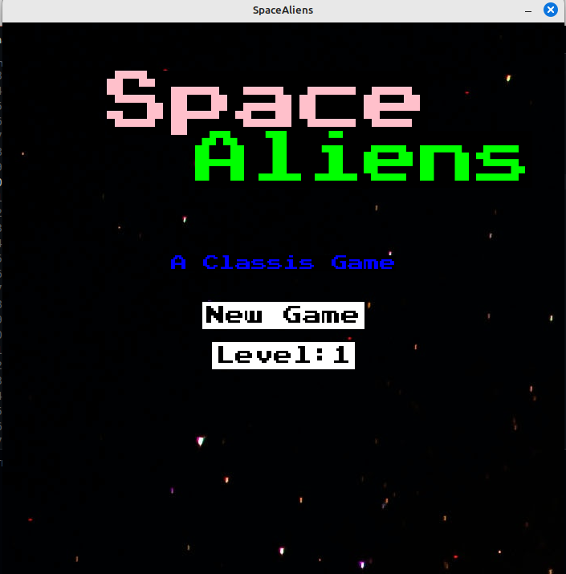
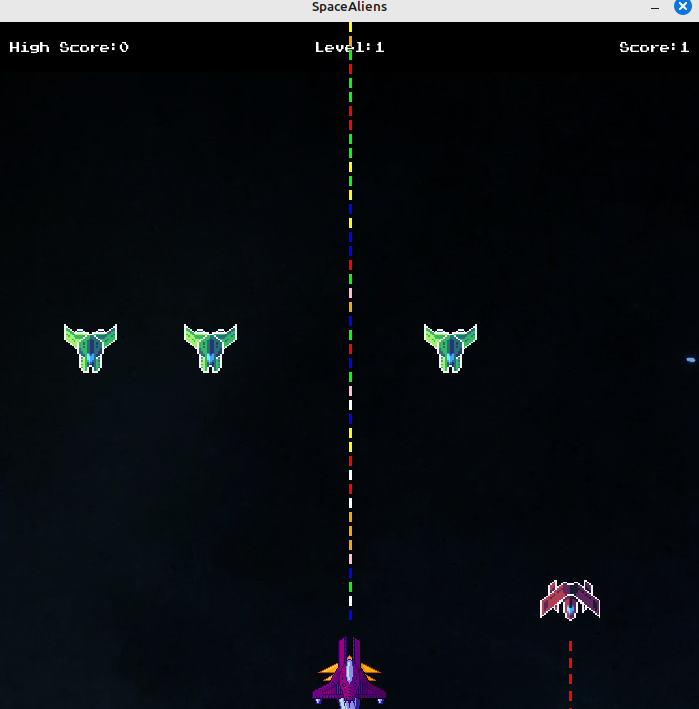
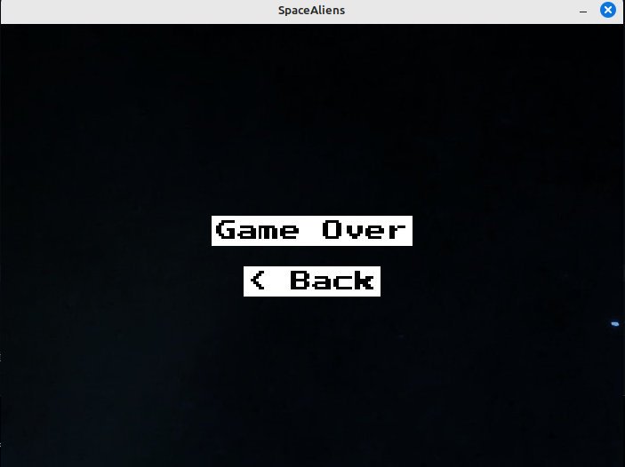
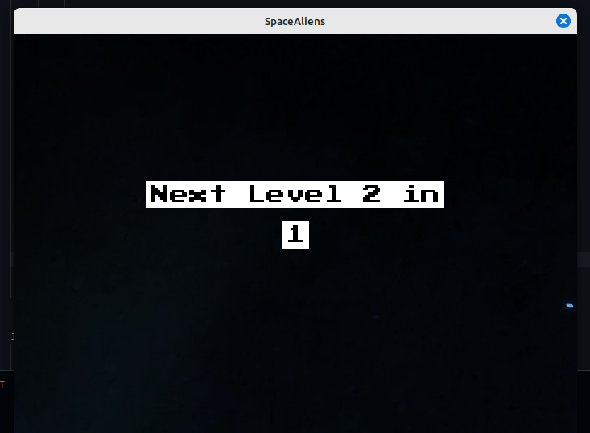

# SpaceAliens

## Image or Game Play

### Intro Screen
---

### Main Screen
---

### GAMEOVER Screen
---

### Pre Next Screen
---

## Instructions

+ Right-arrow-button to move ship **right**.
+ Left-arrow-button to move ship **left**.
+ Ship can fire bullet automaticlly. 
+ Level will increase every time player distroied the alien fleet.
+ If alien or aliens hit your ship or cross your ship **GAMEOVER**
+ Player can not move ship up and down *(for now.)*.
+ Scoreboard update after **GAMEOVER**.
+ Player can enable sheild by pressing Space.

## Future features

+ Player have different type of bullets that have greater impact on aliens.
+ After some level different types of alien attack.
+ Player can upgrade their Ship.
+ Music will add soon.
+ .....